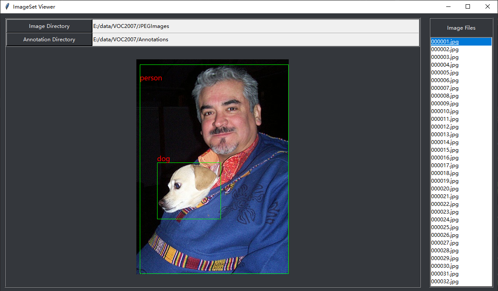

# ImageSet Viewer

A GUI, for object detection dataset. Displaying single image with bounding boxes (if any). Now only support PASCAL VOC format.

## Dependencies

- Python

Support Python 2 & 3

Anaconda installed Python is recommended

- Python packages

`pip install image pillow lxml numpy opencv-python`

- apt packages

`sudo apt-get install python-imaging-tk` # execute this line if pip can't install image

## Supported Function
- Choosing image folder via button
- Viewing images with annotated bounding boxes via mouse or arrowdown key
- Change box thick (in code)
- Displaying with specified resizing image height/width (in code)
